# Todoist for Plasma

Your Todoist tasks on the KDE Plasma 6 desktop and panel: **Inbox, Today, Upcoming, projects, labels and filters**, like the lists in Todoist's sidebar. Complete tasks with one click, add new ones with Todoist's natural language, and edit, reschedule, move or delete them from a task menu. Works offline.

> Unofficial. Not created by, affiliated with, or supported by Doist.

<p align="center">
  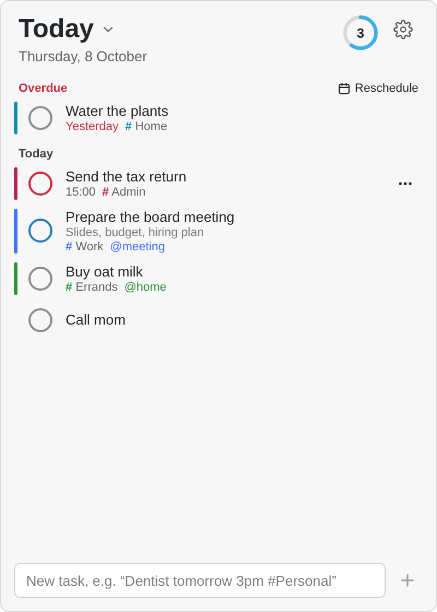
  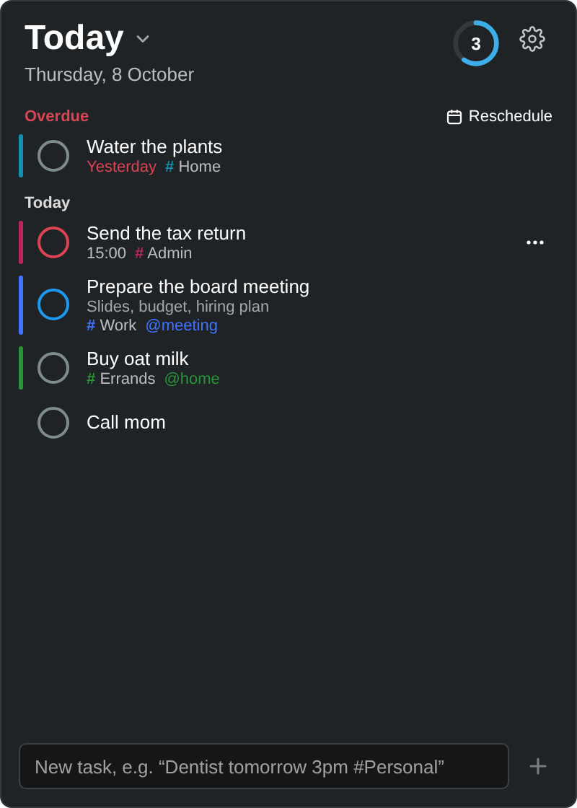
  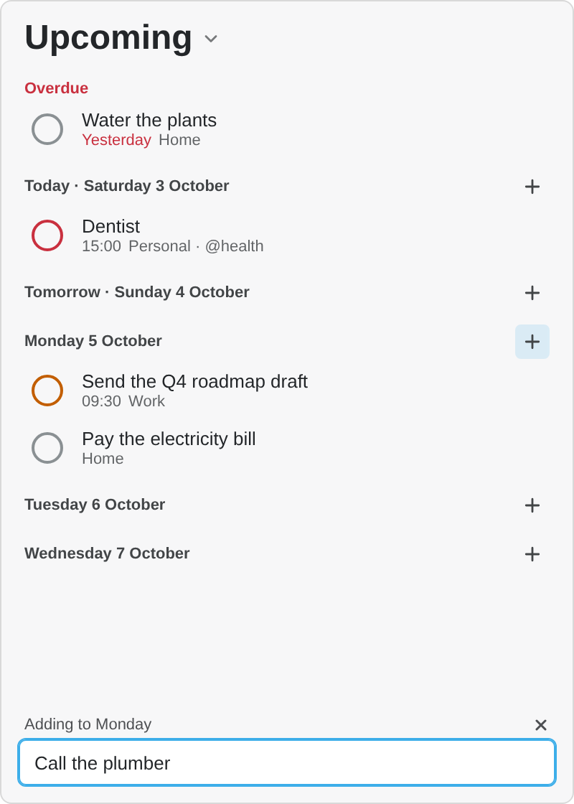
</p>

- **Lists:** click the list title ("Today ▾") to switch between Inbox, Today, Upcoming (the next 7 days, day by day), your projects (with sections and indented sub-tasks), labels and saved filters. Each entry shows its task count.
- **Pin a list to a widget:** in the list title menu choose *Start here in this widget*. For example, put a "Work" project widget and a Today widget side by side on the desktop. You can still switch lists in a pinned widget.
- **Panel:** an icon with a count badge for Today (red when something is overdue). Click it to open the list. The badge can instead count the current list, or be turned off, in the settings.
- **Desktop, small:** a big count and the next task of the list.
- **Desktop, large / popup:** the full list with round, priority-coloured check circles, a completion animation, a "New task" field and an "All done" state.
- **Follows your Plasma theme:** light/dark, accent colour, font size and animation speed. No hard-coded colours.
- **Offline-first:** tasks are cached, and completions/additions made offline are queued. The queue survives Plasma restarts and is sent once you are back online.
- **Task menu:** right-click a task (or use its ⋯ button) to edit it, reschedule it, change priority, move it to another project, copy its link, show its full description, or delete it. Completing and deleting can be undone for a few seconds.
- **Details at a glance:** labels, deadlines (red when due), the first line of the description (click it for the rest), and sub-tasks you can fold away in projects.
- **Reminders:** a Plasma notification before a timed task (10 minutes by default), with *Complete* and *Remind me in 10 minutes*.
- **Daily goal:** a small ring shows how close you are to your Todoist daily goal.
- **Keyboard:** see [Keyboard](#keyboard). Assign a global shortcut to add a task from anywhere.
- **Sync:** every 5 minutes, when you open the popup or hover the desktop widget (if the data is older than 30 s), and about a second after you complete or add something.

## Screenshots

| | | |
|:---:|:---:|:---:|
| 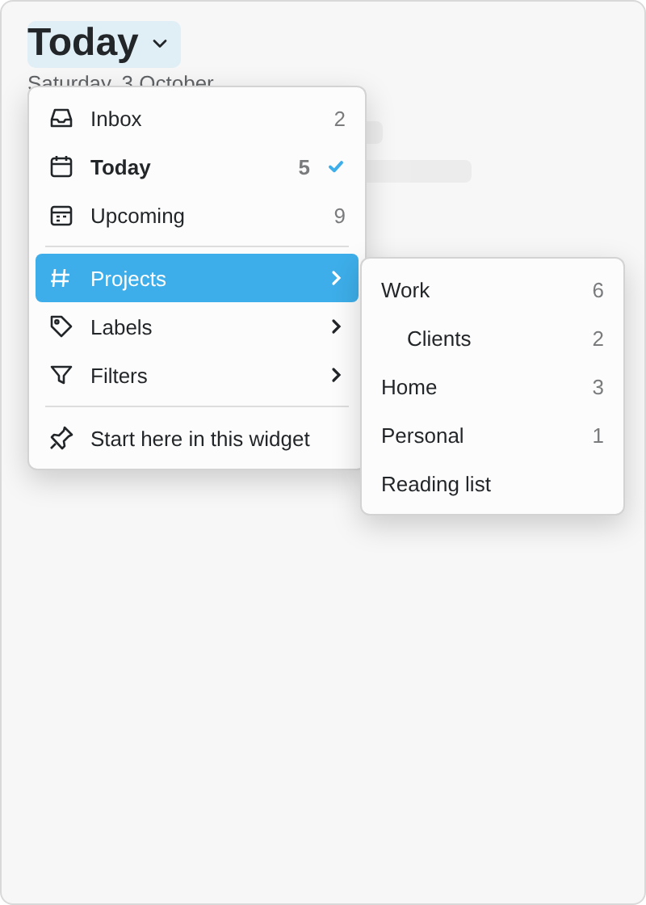 | 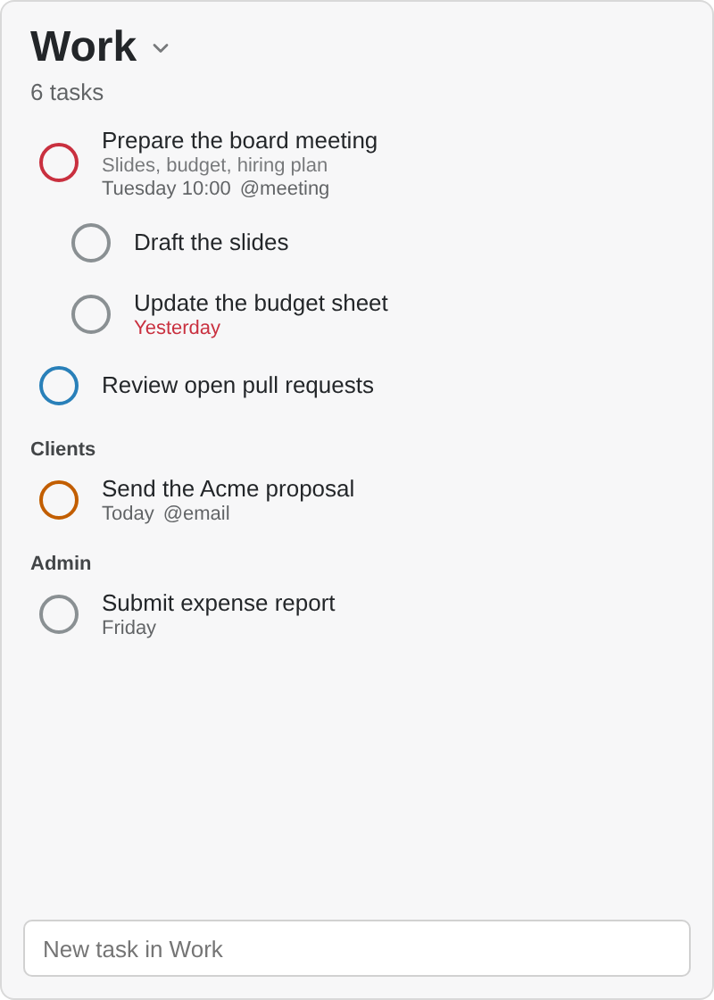 | 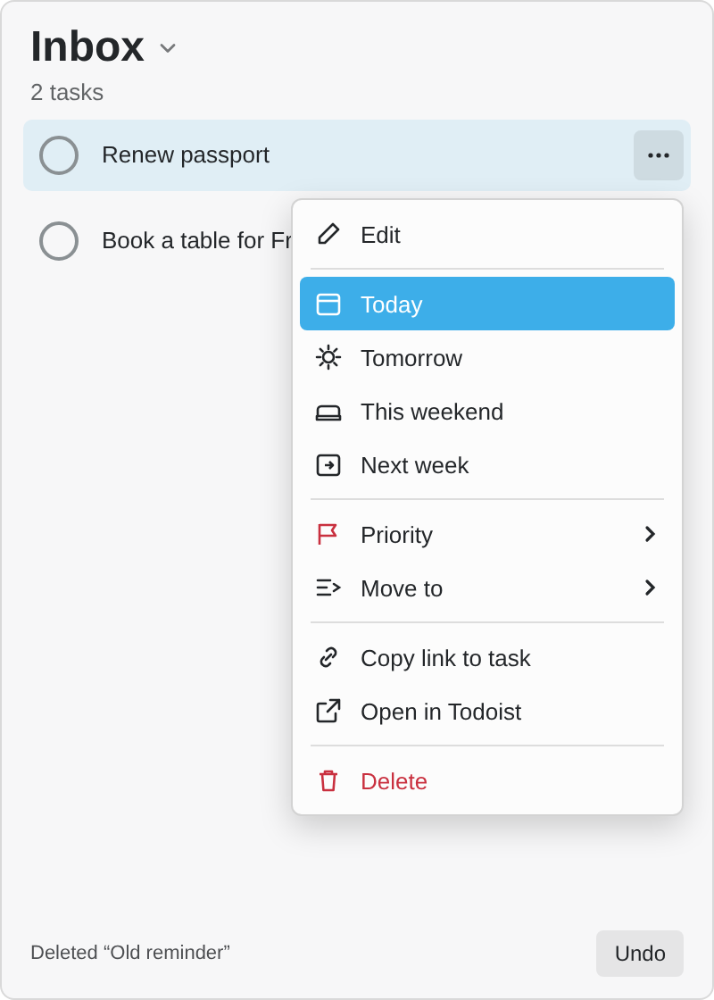 |
| Switch lists from the title | Projects: sections and sub-tasks | Task menu, delete with undo |
| 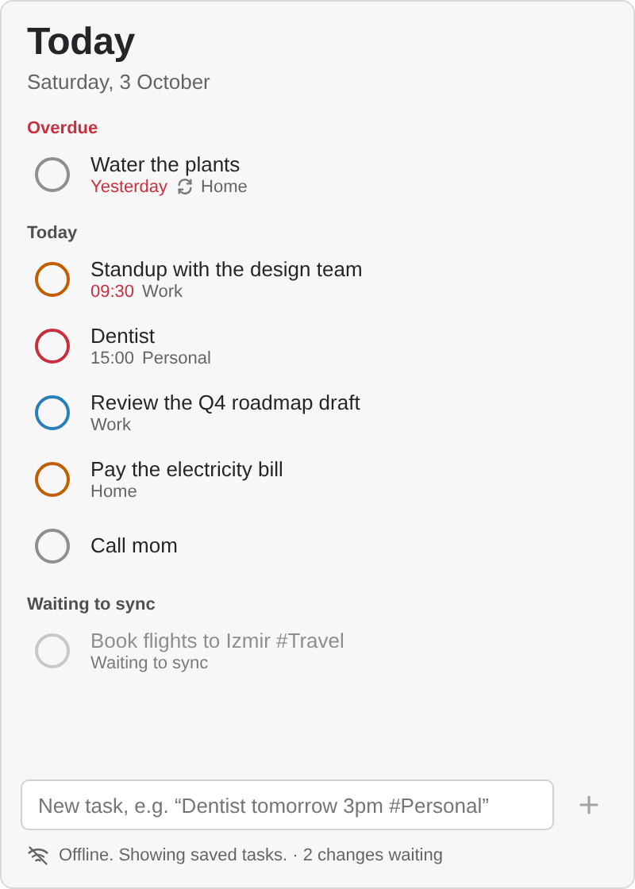 | 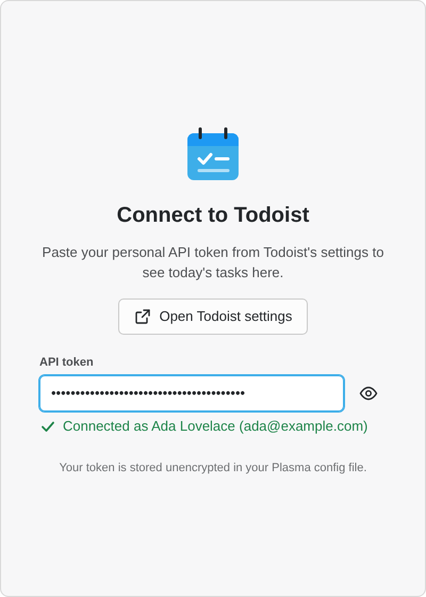 | 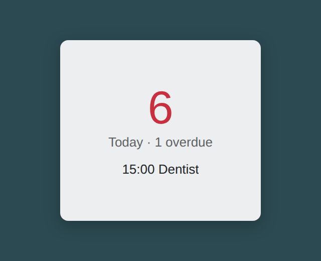 |
| Offline, changes waiting | One-screen setup | Small desktop size |

<p align="center">
  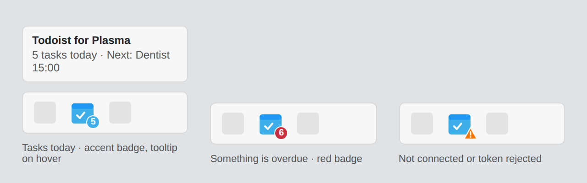
</p>

| | |
|:---:|:---:|
| 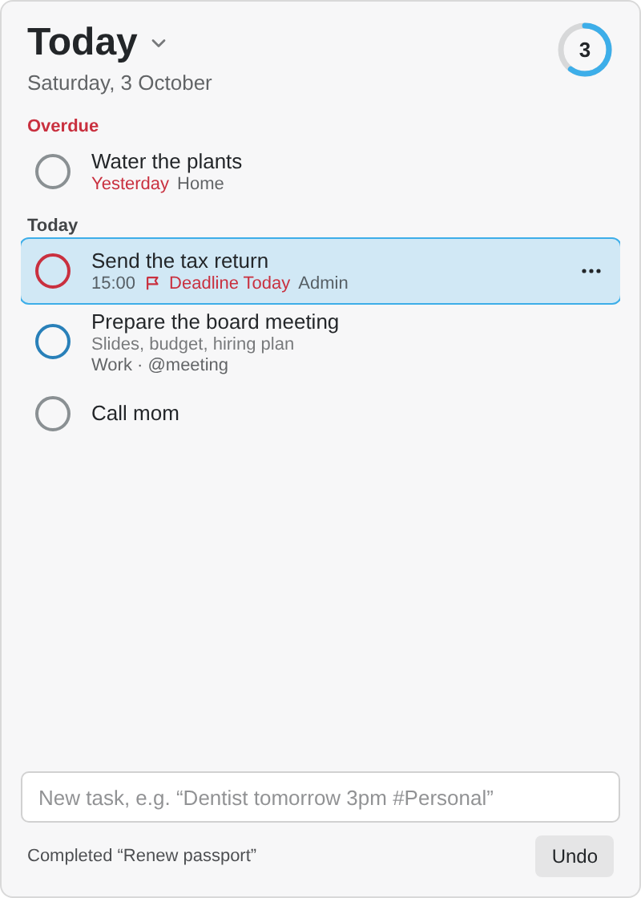 | 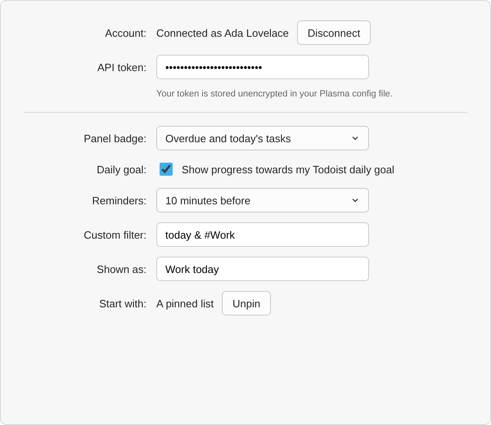 |
| Daily goal, deadline, keyboard selection, undo | Settings → General |

<p align="center">
  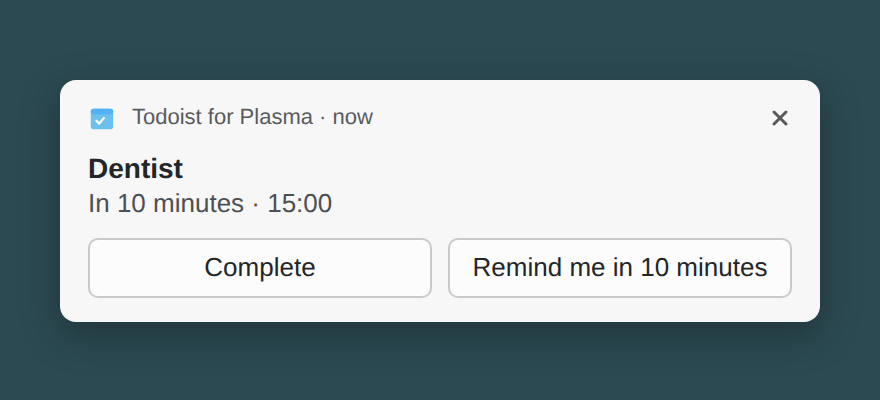<br>
  <sub>Reminder before a timed task</sub>
</p>
<p align="center">
  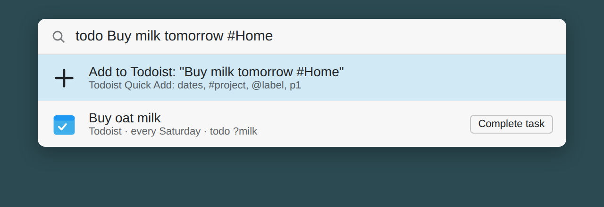<br>
  <sub>Optional KRunner plugin</sub>
</p>

<sub>Rendered from the design mockups. On your desktop the widget uses your Plasma theme, fonts and icons.</sub>

## Keyboard

- **Add a task from anywhere:** right-click the widget → *Configure…* → *Keyboard Shortcuts*, and pick a shortcut (for example Meta+T). Pressing it opens the widget with the cursor in *New task*, like Todoist's global Quick Add.
- **In the list:** ↑/↓ move, Space completes, E or F2 edits, T opens the task menu, 1–4 set the priority, Delete deletes, Enter opens the task in Todoist, Q or / jumps to *New task*, Esc leaves the list.

## More options

- **Background:** in edit mode the widget's toolbar can switch its background off, for a frameless list on the wallpaper.
- **Several widgets:** once one widget is connected, the next one offers *Use the connected account*, so you don't paste the token again. (Each widget keeps its own cache.)
- **Custom filter:** in the settings, enter any Todoist filter query (for example `today & #Work`) without saving it in Todoist. It appears in the list menu.
- **Settings → General:** panel badge, reminder time, daily goal ring, start list.

## KRunner (optional)

`krunner/` contains a small, separate KRunner plugin (Python, D-Bus). It isn't part of the widget package.

```sh
krunner/install.sh      # needs python-dbus and python-gobject (Debian/Ubuntu: python3-dbus python3-gi)
```

Then in KRunner (Alt+Space):

- `todo Buy milk tomorrow #Home`: adds the task with Todoist Quick Add.
- `todo ?milk`: finds open tasks. Enter opens one in Todoist; the *Complete task* action completes it.

It uses the token of your Todoist for Plasma widget (or `TODOIST_TOKEN`, or `token=` under `[General]` in `~/.config/todoist-plasma-runnerrc`). Remove it with `krunner/uninstall.sh`.

## Install

**From a release:** download `todoist-plasma-<version>.plasmoid` from [Releases](https://github.com/bahadirdemircioglu/today/releases), then either

- right-click the desktop → *Enter Edit Mode* → *Add Widgets…* → *Get New Widgets* → *Install Widget From Local File…*, or
- run `kpackagetool6 -t Plasma/Applet -i todoist-plasma-<version>.plasmoid` (use `-u` to upgrade).

Upgrading from 1.x ("Todoist Today"): 2.0 is a new widget with a new id. Remove the old widget, add *Todoist for Plasma* and paste your token again.

**From source:**

```sh
kpackagetool6 -t Plasma/Applet -i package     # first install
kpackagetool6 -t Plasma/Applet -u package     # update
```

Requires Plasma 6.0 or newer. There is nothing to compile.

## Connect your account

1. Add the widget, then click **Open Todoist settings**. This opens *Settings → Integrations → Developer* in Todoist.
2. Copy your **API token** and paste it into the widget. It is checked right away and shows "Connected as *your name*".

You can also connect, or disconnect, from the widget's *Configure…* window. If you use the widget both in a panel and on the desktop, paste the token in each.

## Adding tasks

Whatever you type goes to Todoist's [Quick Add](https://todoist.com/help/articles/use-task-quick-add-in-todoist-va4Lhpzz), so the usual syntax works:

| You type | Result |
|---|---|
| `Call mom today p1` | due today, priority 1 |
| `Dentist tomorrow 3pm #Personal` | due tomorrow 15:00 in *Personal* (you'll see "Added to Personal · tomorrow 3pm") |
| `Pay rent every 1st @home` | recurring, labelled |
| `Buy milk // two litres` | due today (no date given), with a description |

Where a new task lands depends on the list you add it from, like on the web. Anything you type yourself (a date, `#project`, `@label`) always wins:

| List | A task typed without that information… |
|---|---|
| Today | is due today |
| Upcoming | is due on the day whose **+** you clicked (otherwise today) |
| A project | goes into that project |
| Inbox | stays in the Inbox, undated |
| A label | gets that label |

Dates are parsed in the language your Todoist account uses. English always works; Todoist's date parser may not support every language (for example Turkish), while `#project`, `@label` and `p1`–`p4` work in any language.

## Security

- Your API token is stored **unencrypted** in your Plasma config file (`~/.config/plasma-org.kde.plasma.desktop-appletsrc`), readable by your user account. This is a deliberate trade-off: the widget is pure QML, so it cannot use KWallet. If the token leaks, reset it in Todoist's developer settings; the widget will ask for the new one.
- The token is never logged and never shown in tooltips or error messages.
- The widget talks only to `https://api.todoist.com`. Task text is always rendered as plain text, and Markdown links are reduced to their label.
- The task cache and offline queue live in `~/.local/share/plasmashell/QML/OfflineStorage/Databases/` (SQLite).

## Known limitations

- **Time zones:** "today" follows your Todoist time zone. When your computer is in a *different* time zone than your Todoist account, a fixed-time-zone task can shift by an hour across a daylight-saving boundary (rarely enough to move it to another day), and the day can switch up to 5 minutes late at a DST change. When both zones match, which is the normal case, this does not apply.
- **Offline Quick Add:** if the connection drops right after a new task was sent, the widget can't know whether Todoist created it. After the next sync it looks for a matching new task before sending it again. If no match is found, a duplicate is possible, though rare.
- **Filters** (saved or custom) are evaluated by Todoist, so a filter list needs a connection to refresh. Offline it shows the last results with their time.
- A completion reaches Todoist a few seconds later than before, because it can be undone first.
- The **daily goal** ring uses Todoist's productivity stats. If they can't be read, the ring stays hidden.
- **Reminders** look at a task's time, not at Todoist's own reminders. Two widgets never show the same reminder twice.
- **Upcoming** shows a recurring task once, on its next date (the web shows every occurrence).
- In Today, Upcoming, label and filter lists sub-tasks are plain rows; the hierarchy is shown in project and Inbox lists.
- Not supported in the widget (use Todoist for these): reordering, deadlines, reminders, rescheduling recurring tasks, creating or editing projects, sections, labels and filters, and completed-task history.

## Troubleshooting

- Logs: `journalctl --user -f -t plasmashell | grep todoist-plasma`. Running `plasmoidviewer -a package` prints them to the terminal.
- After updating the package, restart Plasma if the old version keeps showing: `systemctl --user restart plasma-plasmashell`.
- "Todoist didn't accept your token": the token was reset or revoked. Paste the current one from Todoist's settings.

## Development

```sh
npm test                                   # Node ≥ 20, zero dependencies
npm run check                              # everything CI checks: tests, runner tests, translations up to date
plasmoidviewer -a package                  # desktop form factor
plasmoidviewer -a package -l bottomedge -f horizontal   # panel
LANGUAGE=tr LANG=tr_TR.UTF-8 plasmoidviewer -a package  # Turkish UI (run scripts/i18n-build.sh first)
scripts/i18n-extract.sh                    # update translations/template.pot and *.po
scripts/i18n-build.sh                      # compile .mo files into package/contents/locale
scripts/package.sh                         # dist/todoist-plasma-<version>.plasmoid
```

All decision logic is plain JavaScript in `package/contents/ui/logic/` (`.pragma library` files, no QML or network dependencies), unit-tested in Node via `tests/helpers/load-qml-js.mjs`:

| File | Role |
|---|---|
| `DateUtil.js` | time-zone offsets, day keys, Todoist `due` parsing |
| `TaskStore.js` | merging `/sync` responses (tasks, projects, sections, labels, filters), the offline overlay, the Today list |
| `ViewModel.js` | Inbox, Upcoming, project, label and filter lists, list rows and the navigation list |
| `ContextRules.js` | where a task added from a list lands (date, project, label) |
| `Reminders.js` | which timed tasks to notify about, snoozes |
| `Goals.js` | daily goal progress from Todoist's productivity stats |
| `CommandQueue.js` | the persistent offline queue (complete, update, move, delete commands; Quick Adds) |
| `SyncMachine.js` | the sync state machine: debouncing, retries/backoff, recovery, account checks |
| `TodoistClient.js` | HTTP via `XMLHttpRequest` and response classification |
| `ModelSync.js` | minimal `ListModel` updates so only changed rows animate |
| `Storage.js` | LocalStorage persistence (QML-only, not unit-tested) |

`SyncController.qml` only executes the effects `SyncMachine` returns. The KRunner plugin's helpers are tested with `python3 -m unittest discover -s krunner/tests`. The architecture plans are in [`docs/architecture/`](docs/architecture/INDEX.md): v1 (sync, offline queue, state machine; checklist M1–M23), v2 (lists; M-v2-1…6) and v2.1 (the features above; M-v21-1…8).

Releases: bump `Version` in `package/metadata.json` and `package.json`, add a CHANGELOG section, then push a `vX.Y.Z` tag. CI builds the `.plasmoid` and attaches it to a GitHub Release.

## License

GPL-3.0-or-later. See [LICENSE](LICENSE).
